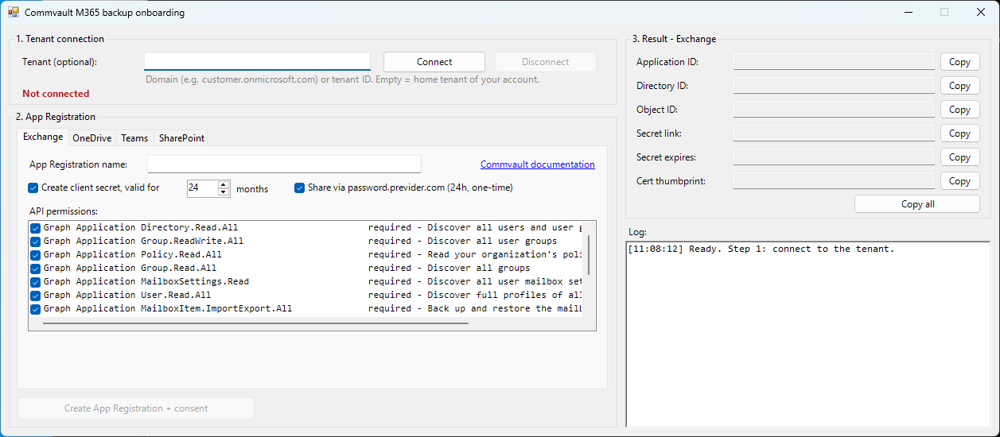

# Commvault M365 backup onboarding

A PowerShell GUI that creates the Azure App Registrations Commvault needs to back up Microsoft 365. The tool covers **Exchange Online**, **OneDrive for Business**, **Teams** and **SharePoint Online**. It sets the API permissions from the Commvault documentation and grants admin consent in one go. You can create a client secret and share it through a one-time link.



## Features

- **Tenant connection:** connect to or disconnect from any tenant with an interactive Microsoft Graph sign-in. You can enter a domain or tenant ID, or leave it empty to use your home tenant.
- **One tab per workload:** Exchange, OneDrive, Teams and SharePoint. Each tab has its own App Registration name and permission set, and a link to the Commvault documentation for that workload.
- **Permissions + admin consent:** adds the required API permissions, creates the service principal (Enterprise application) and grants tenant-wide admin consent. This covers application permissions and delegated permissions.
- **Existing apps:** if an app with the same name already exists, you can choose to update it. Existing permissions and redirect URIs are kept.
- **Client secret:** optional, valid for 1 to 24 months. By default it is shared as a one-time link on [password.previder.com](https://password.previder.com/) (valid 24 hours, can be opened once) instead of being shown in plain text.
- **Teams:** you can add a Web redirect URI (`https://<hostname>/commandcenter/processAzureAuthToken.do`).
- **SharePoint:** you can select a certificate (`.cer`, `.crt`, `.pfx`) or generate a self-signed one. The public key is uploaded to the app.
- **Output per workload:** Application (client) ID, Directory (tenant) ID, Object ID, secret link, secret expiry and certificate thumbprint. Each value has a Copy button, and **Copy all** copies everything at once.

## Requirements

| | |
|---|---|
| OS | Windows (WinForms) |
| PowerShell | Windows PowerShell 5.1 or PowerShell 7.x |
| Module | `Microsoft.Graph.Authentication`. If it is missing, the tool offers to install it for the current user. |
| Account | **Global Administrator** or **Privileged Role Administrator**. These roles are required to grant admin consent for Microsoft Graph application permissions. |

When you connect, the tool requests these delegated scopes: `User.Read`, `Application.ReadWrite.All`, `AppRoleAssignment.ReadWrite.All`, `DelegatedPermissionGrant.ReadWrite.All`.

## Usage

1. Download `Commvault-M365-Backup-Onboarding.ps1`.
2. If Windows blocks the downloaded file, unblock it:
   ```powershell
   Unblock-File .\Commvault-M365-Backup-Onboarding.ps1
   ```
3. Start the tool:
   ```powershell
   powershell.exe -ExecutionPolicy Bypass -File .\Commvault-M365-Backup-Onboarding.ps1
   # or
   pwsh.exe -ExecutionPolicy Bypass -File .\Commvault-M365-Backup-Onboarding.ps1
   ```
4. **1. Tenant connection:** optionally enter the customer domain or tenant ID, then click **Connect** and sign in.
5. **2. App Registration:** choose the workload tab, enter the App Registration name and review the permissions. Then click **Create App Registration + consent**.
6. **3. Result:** copy the values into Commvault Command Center.
7. Click **Disconnect** when you are done. Closing the window also disconnects.

## Permissions per workload

Permissions marked *optional* are unchecked by default, unless the table says otherwise. You can change any selection per tab before creating the app.

### Exchange Online

Source: [Application Permissions for the Azure App for Exchange Online](https://documentation.commvault.com/11.40/software/application_permissions_for_azure_app_for_exchange_online.html)

| API | Type | Permission | Default |
|---|---|---|---|
| Microsoft Graph | Application | Directory.Read.All | required |
| Microsoft Graph | Application | Group.ReadWrite.All | required |
| Microsoft Graph | Application | Policy.Read.All | required |
| Microsoft Graph | Application | Group.Read.All | required |
| Microsoft Graph | Application | MailboxSettings.Read | required |
| Microsoft Graph | Application | User.Read.All | required |
| Microsoft Graph | Application | MailboxItem.ImportExport.All | required |
| Microsoft Graph | Application | MailboxItem.Read.All | optional |
| Microsoft Graph | Application | MailboxFolder.Read.All | optional |
| Microsoft Graph | Application | Application.ReadWrite.All | optional (Metallic only) |
| Microsoft Graph | Delegated | Directory.AccessAsUser.All | optional |
| Office 365 Exchange Online | Application | full_access_as_app | required |

### OneDrive for Business

Source: [Register the Azure App for OneDrive for Business with Azure AD](https://documentation.commvault.com/11.40/software/register_azure_app_for_onedrive_for_business_with_azure_ad.html)

| API | Type | Permission |
|---|---|---|
| Microsoft Graph | Application | Directory.Read.All |
| Microsoft Graph | Application | Files.ReadWrite.All |
| Microsoft Graph | Application | User.Read.All |
| Microsoft Graph | Application | Notes.ReadWrite.All |
| Microsoft Graph | Application | Application.ReadWrite.All |
| Microsoft Graph | Application | Reports.Read.All |

### Teams

Source: [Register the Azure App for Teams with Azure AD](https://documentation.commvault.com/11.40/software/register_azure_app_for_teams_with_azure_ad.html)

| API | Type | Permissions |
|---|---|---|
| Microsoft Graph | Application | Application.ReadWrite.All, Channel.Create, Channel.ReadBasic.All, ChannelMember.ReadWrite.All, ChannelMessage.Read.All, ChannelSettings.ReadWrite.All, Chat.Read.All, Directory.Read.All, Files.ReadWrite.All, Group.ReadWrite.All, Notes.ReadWrite.All, Reports.Read.All, Sites.FullControl.All, Team.ReadBasic.All, TeamsAppInstallation.ReadWriteForTeam.All, TeamMember.ReadWrite.All, TeamworkTag.ReadWrite.All, Tasks.ReadWrite.All, User.Read.All |
| Microsoft Graph | Delegated | ChannelMessage.Read.All, ChannelMessage.Send, Directory.AccessAsUser.All, Group.ReadWrite.All, Notes.ReadWrite.All (optional, OneNote restore only; checked by default), offline_access, openid |
| Office 365 Exchange Online | Application | full_access_as_app |

**Redirect URI (Web):** `https://<hostname>/commandcenter/processAzureAuthToken.do`, where `<hostname>` is your Command Center host. To add several URIs, separate them with `;`. If you leave the placeholder unchanged, no redirect URI is set.

### SharePoint Online

Source: [Register the Azure App for SharePoint Online with Azure AD](https://documentation.commvault.com/11.40/software/register_azure_app_for_sharepoint_online_with_azure_ad.html)

| API | Type | Permission | Default |
|---|---|---|---|
| Office 365 SharePoint Online | Application | Sites.FullControl.All | required |
| Microsoft Graph | Application | Sites.FullControl.All | required |
| Microsoft Graph | Application | Group.ReadWrite.All | required |
| Microsoft Graph | Application | Directory.Read.All | required |
| Microsoft Graph | Application | Application.ReadWrite.All | required |
| Microsoft Graph | Application | Reports.Read.All | optional (reports only) |

**Certificate:**

- **Browse...** selects an existing `.cer`, `.crt` or `.pfx`. For a `.pfx`, the tool asks for the password.
- **Generate...** creates a self-signed certificate (RSA 2048, SHA-256, valid for 1 to 10 years). It saves the `.pfx` (password protected) and the `.cer` side by side. The temporary copy in `Cert:\CurrentUser\My` is removed afterwards.
- Only the public key is uploaded to the App Registration. Upload the `.pfx` and its password in Commvault Command Center.

## Client secret sharing (password.previder.com)

When **Share via password.previder.com** is checked:

1. The tool generates a random 256-bit key.
2. It encrypts the secret locally with AES-256-CTR, the same scheme the website uses in the browser.
3. Only the **ciphertext** is posted to `https://password.previder.com/password/`, with a validity of 24 hours.
4. The link has the form `https://password.previder.com/#<id>/<key>`. The key is only in the URL fragment, which is never sent to the server.

The link can be retrieved **once**. **Do not open it yourself** before sending it to the person who needs it. If creating the link fails, the tool shows the secret in plain text so it is not lost.

To show the secret directly instead, uncheck the option.

## Notes and limitations

- **Certificates on existing apps:** Microsoft Graph cannot append a certificate to an app that already has certificates. The tool asks before it replaces them.
- **Permissions that do not exist:** if Microsoft Graph does not know a permission in a tenant, the tool skips it and reports it in the log. It does not stop.
- **Replication delay:** a new app or service principal can take a few seconds to replicate. Consent calls are retried automatically.
- **Application.ReadWrite.All:** this permission is very powerful. Only keep it where Commvault requires it.
- **Scaling:** the window scales with the Windows display setting (125%, 150%, ...). On small screens it gets scrollbars.
- **Scope of the tool:** it creates and updates apps only. It never deletes App Registrations, secrets or consent.

## Troubleshooting

| Problem | Solution |
|---|---|
| Nothing happens after **Connect** | The sign-in window may be behind the tool window. Check the taskbar. |
| Sign-in fails from the GUI (WAM) | The tool automatically retries with browser sign-in. |
| `Authorization_RequestDenied` / `Insufficient privileges` | Sign in with a Global Administrator or Privileged Role Administrator. |
| Script does not start | Run `Unblock-File` and start the tool with `-ExecutionPolicy Bypass`. |

## Disclaimer

This tool is not affiliated with or supported by Commvault or Microsoft. Always verify the required permissions against the latest [Commvault documentation](https://documentation.commvault.com/). Test in a non-production tenant first.
